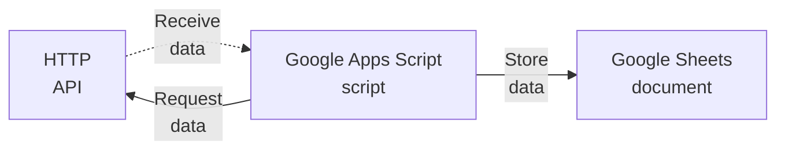

# nmdc-metrics-fetcher

`nmdc-metrics-fetcher` is a tool you can use to collect metrics-related data about the NMDC system.

It is implemented as a [Google Apps Script](https://www.google.com/script/start/) and a [Google Sheets](https://sheets.google.com/) document.

The Google Apps Script fetches metrics data from various NMDC HTTP APIs; then it stores that metrics data in a Google Sheets document.



## Setup

Here's how you can set up the tool:

### Prerequisites

- You have a [Google Account](https://support.google.com/accounts/answer/27441?hl=en) (free)

### Procedure

#### 1. Set up the Google Sheets document.

1. In your web browser, visit Google Sheets at https://sheets.google.com.
1. Click the `+` thumbnail to create a new Blank spreadsheet.
1. Rename the spreadsheet to "`nmdc-metrics-fetcher-data`" (or any other name you want).
1. On the spreadsheet, create tabs (i.e. sheets) having the following names:
   1. `data.NMDC_DATA_PORTAL_STATS`
   1. `data.NMDC_RUNTIME_STATS`
   1. `data.NMDC_EDGE_STATS`
   > You can rename the default `Sheet1` tab to one of those if you'd like; or leave it alone and create all new tabs.
1. On the `data.NMDC_DATA_PORTAL_STATS` tab, populate Row 1 (i.e. the header cells) with the following values:
   - | timestamp | studies | locations | habitats | data_size | metagenomes | metatranscriptomes | proteomics | metabolomics | lipodomics | organic_matter_characterization |
     | --- | --- | --- | --- | --- | --- | --- | --- | --- | --- | --- |
1. On the `data.NMDC_RUNTIME_STATS` tab, populate Row 1 (i.e. the header cells) with the following values:
   - | timestamp | omics_processing_set_count | biosample_set_count | nom_analysis_activity_set_count | collecting_biosamples_from_site_set_count | mags_activity_set_count | library_preparation_set_count | metaproteomics_analysis_activity_set_count | metagenome_sequencing_activity_set_count | metagenome_annotation_activity_set_count | material_sample_set_count | activity_set_count | read_qc_analysis_activity_set_count | field_research_site_set_count | functional_annotation_agg_count | read_based_taxonomy_analysis_activity_set_count | pooling_set_count | processed_sample_set_count | metagenome_assembly_set_count | extraction_set_count | metatranscriptome_activity_set_count | metabolomics_analysis_activity_set_count | study_set_count | data_object_set_count |
     | --- | --- | --- | --- | --- | --- | --- | --- | --- | --- | --- | --- | --- | --- | --- | --- | --- | --- | --- | --- | --- | --- | --- | --- |
   > Since that can make the row appear quite wide; I recommend (in Google Sheets) selecting the header cells, then clicking `Format > Rotation > Rotate up` in order to rotate the header text 90 degrees counter-clockwise.
1. On the `data.NMDC_EDGE_STATS` tab, populate Row 1 (i.e. the header cells) with the following values:
   - | timestamp | num_projects | num_users |
     | --- | --- | --- |
1. Copy the URL of the spreadsheet for use in a later step.

At this point, the Google Sheet document (i.e. spreadsheet) is set up. In the next section, you'll set up the Google Apps Script that will eventually write to that Google Sheets document.

#### 2. Set up the Google Apps Script project.

1. Visit https://script.google.com/home/projects/create to create a new Google Apps Script project.
1. In the Google Apps Script editor that appears, rename the project to "`nmdc-metrics-fetcher`" (or any other name you want).
    - You can do that by clicking on "Untitled project" at the top of the page.
1. In the editor, create a new script file named "`Config`".
    - In the "Files" section in the sidebar, click the `+` icon and select `Script`.
    - Enter the file's name as "`Config`" (without a suffix). The editor will automatically append `.gs` to its name.
1. In this repository, copy the contents of `Code.gs` and paste it into the `Code.gs` file in the editor, replacing its original contents.
1. Similarly, in this repository, copy the contents of `Config.gs` and paste it into the `Config.gs` file in the editor, replacing its original contents.
1. In the `Config.gs` file, update the `GOOGLE_SHEETS_DOCUMENT_URL` value to be the URL of the Google Sheets document you set up earlier. For example:
   ```diff
   - GOOGLE_SHEETS_DOCUMENT_URL: "__REPLACE_ME__",
   + GOOGLE_SHEETS_DOCUMENT_URL: "https://docs.google.com/spreadsheets/d/1xt...x2Y/",
   ```
1. Click the disk icon to save the project.

At this point, the Google Apps Script project is set up—except for one thing: you haven't scheduled the script to run at any particular time. You'll do that in the next section.

#### 3. Add a Time-based Trigger.

1. In the Google Apps Script editor, in the project-level sidebar (to the left of the "Files", "Libraries", and "Services" sidebar), click the "Triggers" link.
1. On the "Triggers" page, click the "Add Trigger" button in the lower right.
1. In the "Add Trigger..." modal window that appears, configure the trigger as shown here:
   1. Choose which function to run: `main`
   1. Choose which deployment should run: `Head` (default)
   1. Select event source: `Time-driven` (default)
   1. Select type of time based trigger: `Day timer`
   1. Select time of day: `Midnight to 1am` (or whatever time of day you want)
   1. Failure notification settings: `Notify my daily` (or whatever frequency you want)
1. Click the "Save" button to create the trigger.
1. If prompted, follow the prompts to authorize the Google Apps Script script to access the Google Sheets document.
1. Verify the "Triggers" page lists the newly-created trigger.

That's it! Google Apps Script is now configured to run the script once a day.