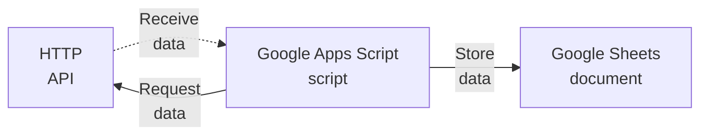

# nmdc-metrics-fetcher

`nmdc-metrics-fetcher` is a tool you can use to collect metrics-related data about the NMDC system.

It is implemented as a [Google Apps Script](https://www.google.com/script/start/) and a [Google Sheets](https://sheets.google.com/) document.

The Google Apps Script fetches metrics data from various NMDC HTTP APIs; then it stores that metrics data in a Google Sheets document.



## Setup

Here's how you can set up the tool:

### Prerequisites

- You have a [Google Account](https://support.google.com/accounts/answer/27441?hl=en) (free)

### Procedure

#### 1. Set up the Google Sheets document.

- TODO. This will involve creating the necessary tabs and columns in the Google Sheets document.

#### 2. Set up the Google Apps Script project.

1. Visit https://script.google.com/home/projects/create to create a new Google Apps Script project.
1. In the Google Apps Script editor that appears, rename the project to "`nmdc-metrics-fetcher`".
    - You can do that by clicking on "Untitled project" at the top of the page.
1. In the editor, create a new script file named "`Config`".
    - In the "Files" section in the sidebar, click the `+` icon and select `Script`.
    - Enter the file's name as "`Config`" (without a suffix). The editor will automatically append `.gs` to its name.
1. In this repository, copy the contents of `Code.gs` and paste it into the `Code.gs` file in the editor, replacing its original contents.
1. Similarly, in this repository, copy the contents of `Config.gs` and paste it into the `Config.gs` file in the editor, replacing its original contents.
1. In the `Config.gs` file, update the `GOOGLE_SHEETS_DOCUMENT_URL` value to be the URL of the Google Sheets document you set up earlier. For example:
   ```diff
   - GOOGLE_SHEETS_DOCUMENT_URL: "__REPLACE_ME__",
   + GOOGLE_SHEETS_DOCUMENT_URL: "https://docs.google.com/spreadsheets/d/1xt...x2Y/",
   ```
1. Click the disk icon to save the project.

#### 3. Add a Time-based Trigger.

- TODO. This will involve adding a Trigger and granting the Google Apps Script script access to the Google Sheets document.
